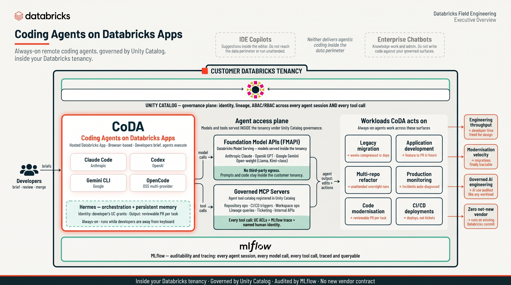

# Coding Agents on Databricks Apps


[](https://github.com/datasciencemonkey/coding-agents-databricks-apps/generate)
[](docs/deployment.md)
[](#whats-inside)
[](#-all-39-skills)

> Run Claude Code, Codex, Gemini CLI, Hermes Agent, and OpenCode in your browser — zero setup, wired to your Databricks workspace.

---

<div align="center">
  <video src="https://github.com/user-attachments/assets/40405b46-532a-4f14-82e3-414cb3744684" controls width="900">
    Your browser doesn't render embedded MP4s here — <a href="docs/videos/CoDAFunkyPromo.mp4">download or open the video directly</a>.
  </video>
</div>

## Screenshots

<div align="center">
  
</div>

---

## Architecture

<div align="center">
  
</div>

CoDA runs as a hosted Databricks App inside your tenancy, alongside **Genie Code** — Databricks' in-product AI coding agent that lives in notebooks, the SQL editor, and dashboards. Genie Code is the interactive in-product surface; CoDA is the always-on hosted-app surface where Developers brief the agents through the browser and Claude Code, Codex, Gemini CLI, and OpenCode execute alongside the Hermes orchestrator. Both surfaces share the same access plane: every model call routes through Foundation Model APIs (no third-party egress) and every tool call routes through Governed MCP Servers (Unity Catalog ACLs + MLflow trace + named human identity). The result: agentic coding for legacy migration, application development, multi-repo refactor, production monitoring, code modernisation, and CI/CD deployments — all governed like any other workload.

---

## What's Inside

🟠 **Claude Code** — Anthropic's coding agent with 39 Databricks skills + 2 MCP servers

🟣 **Codex** — OpenAI's coding agent, pre-configured for Databricks

🔵 **Gemini CLI** — Google's coding agent with shared skills

🟡 **Hermes Agent** — NousResearch's multi-provider AI CLI with tool-calling and skills

🟢 **OpenCode** — Open-source agent with multi-provider support

Every agent installs at boot and connects to your **Databricks AI Gateway** — on first terminal session, paste a short-lived PAT and all CLIs are configured automatically. Token auto-rotates every 10 minutes.

### 📺 Setup walkthrough (6 min)

Want to see CoDA installed and running end-to-end? Click the thumbnail to watch the full walkthrough on YouTube.

<div align="center">
  <a href="https://youtu.be/ofqBQ26_e9o">
    
  </a>
</div>

---

## Why Databricks

This isn't just a terminal in the cloud. Running coding agents on Databricks gives you enterprise-grade infrastructure out of the box:

| | Benefit | What you get |
|---|---|---|
| 🔐 | **Unity Catalog Integration** | All data access governed by UC permissions — agents can only touch what your identity allows |
| 🤖 | **AI Gateway** | Route all LLM calls through a single control plane — swap models, set rate limits, and manage API keys centrally |
| 🔀 | **Multi-AI & Multi-Agent** | Switch between Claude, GPT, Gemini, and open-source models on the fly — change the model or agent without redeploying |
| 📊 | **Consumption Monitoring** | Track token usage, cost, and latency per user and per model via the AI Gateway control center dashboard |
| 🔍 | **MLflow Tracing** | Every Claude Code session is automatically traced — review prompts, tool calls, and outputs in your MLflow experiment |
| 🧬 | **Assess Traces with Genie** | Point Genie at your MLflow traces to ask natural-language questions about agent behavior, cost patterns, and session quality |
| 📝 | **App Logs to Delta** | Optionally route application logs to Delta tables for long-term retention, querying, and dashboarding |

---

## Terminal Features

| | |
|---|---|
| 🎨 **8 Themes** | Dracula, Nord, Solarized, Monokai, GitHub Dark, and more |
| ✂️ **Split Panes** | Run two sessions side by side with a draggable divider |
| 🌐 **WebSocket I/O** | Real-time terminal output over WebSocket — zero-latency, eliminates polling delay |
| 🔁 **HTTP Polling Fallback** | Automatic fallback via Web Worker when WebSocket is unavailable |
| 🚀 **Parallel Setup** | 7 agent setups run in parallel (~5x faster startup) |
| 🔍 **Search** | Find anything in your terminal history (Ctrl+Shift+F) |
| 🎤 **Voice Input** | Dictate commands with your mic (Option+V) |
| 📋 **Image Paste** | Paste or drag-and-drop images into the terminal — saved to `~/uploads/`, path inserted automatically |
| ⌨️ **Customizable** | Fonts, font sizes, themes — all persisted across sessions |
| 🔄 **Workspace Sync** | Every `git commit` auto-syncs to `/Workspace/Users/{you}/projects/` |
| ✏️ **Micro Editor** | Modern terminal editor, pre-installed |
| ⚙️ **Databricks CLI** | Installed at boot, configured interactively on first session |
| 📊 **MLflow Tracing** | Every Claude Code session is automatically traced to your Databricks MLflow experiment |

---

## MLflow Tracing

Claude Code and Codex sessions can both be **automatically traced** to a single Databricks MLflow experiment — flip one switch to turn them on.

### Turning it on

Set **`MLFLOW_TRACING_ENABLED=true`** in `app.yaml` (or your shell for local dev). That single variable enables tracing for both CLIs. Tracing is **off by default** to keep deploys lightweight — opt in when you want it.

```yaml
# app.yaml
env:
  - name: MLFLOW_TRACING_ENABLED
    value: "true"
```

### How it works

```
MLFLOW_TRACING_ENABLED=true
        │
        ├──► Claude Code: Stop hook fires on session end →
        │     mlflow.claude_code.hooks.stop_hook_handler() logs the transcript
        │
        └──► Codex: @mlflow/codex notify hook fires after each turn →
              trace appended to the experiment
```

Both land in the same MLflow experiment, so you can compare runs across agents side by side.

### Where traces live

```
/Users/{your-email}/{app-name}
```

For example, if you're `jane@company.com` and your app is named `coding-agents`:

```
/Users/jane@company.com/coding-agents
```

View them in the Databricks UI: **Workspace > Machine Learning > Experiments**.

### Configuration

Tracing is wired up during app startup:

| Setting | Value | Purpose |
|---------|-------|---------|
| `MLFLOW_TRACING_ENABLED` | `true`/`false` (default `false`) | Master switch for Claude + Codex |
| `MLFLOW_CLAUDE_TRACING_ENABLED` | mirrors `MLFLOW_TRACING_ENABLED` | Gates Claude's Stop hook at runtime |
| `MLFLOW_TRACKING_URI` | `databricks` | Routes traces to the Databricks backend |
| `MLFLOW_EXPERIMENT_NAME` | `/Users/{owner}/{app}` | Target experiment path |
| `MLFLOW_EXPERIMENT_ID` | resolved from name | Set in `~/.codex/.env` (Codex needs an ID) |

Tracing setup is skipped gracefully when `APP_OWNER` is not set (e.g., local dev without Databricks) or when `MLFLOW_TRACING_ENABLED` is left at its default `false`.

---

## Quick Start

### Deploy to Databricks Apps

1. Click [**Use this template**](https://github.com/datasciencemonkey/coding-agents-databricks-apps/generate) to create your own repo
2. Go to **Databricks → Apps → Create App**
3. Choose **Custom App** and connect your new repo
4. Deploy
5. Open the app — paste a short-lived PAT when prompted on first terminal session

That's it. No secrets to configure, no pre-deployment setup.

[→ Full deployment guide](docs/deployment.md) — environment variables, gateway config, and advanced options.

### Run locally

1. Click [**Use this template**](https://github.com/datasciencemonkey/coding-agents-databricks-apps/generate) to create your own repo
2. Clone your new repo and run:

```bash
git clone https://github.com/<you>/<your-repo>.git
cd <your-repo>
uv run python app.py
```

Open [http://localhost:8000](http://localhost:8000) — type `claude`, `codex`, `gemini`, or `opencode` to start coding.

---

<details>
<summary><strong>🧠 All 39 Skills</strong></summary>

### Databricks Skills (25) — [ai-dev-kit](https://github.com/databricks-solutions/ai-dev-kit)

| Category | Skills |
|----------|--------|
| AI & Agents | agent-bricks, genie, mlflow-eval, model-serving |
| Analytics | aibi-dashboards, unity-catalog, metric-views |
| Data Engineering | declarative-pipelines, jobs, structured-streaming, synthetic-data, zerobus-ingest |
| Development | asset-bundles, app-apx, app-python, python-sdk, config, spark-python-data-source |
| Storage | lakebase-autoscale, lakebase-provisioned, vector-search |
| Reference | docs, dbsql, pdf-generation |
| Meta | refresh-databricks-skills |

### Superpowers Skills (14) — [obra/superpowers](https://github.com/obra/superpowers)

| Category | Skills |
|----------|--------|
| Build | brainstorming, writing-plans, executing-plans |
| Code | test-driven-dev, subagent-driven-dev |
| Debug | systematic-debugging, verification |
| Review | requesting-review, receiving-review |
| Ship | finishing-branch, git-worktrees |
| Meta | dispatching-agents, writing-skills, using-superpowers |

</details>

<details>
<summary><strong>🔌 2 MCP Servers</strong></summary>

| Server | What it does |
|--------|-------------|
| **DeepWiki** | Ask questions about any GitHub repo — gets AI-powered answers from the codebase |
| **Exa** | Web search and code context retrieval for up-to-date information |


</details>

<details>
<summary><strong>🏗️ Architecture</strong></summary>

```
┌─────────────────────┐  WebSocket    ┌─────────────────────┐
│   Browser Client    │◄═══════════►│   Gunicorn + Flask   │
│   (xterm.js)        │  (primary)    │   + Flask-SocketIO   │
│                     │───────────►│   (PTY Manager)      │
│                     │  HTTP Poll    │                     │
│                     │  (fallback)   │                     │
└─────────────────────┘               └─────────────────────┘
         │                                     │
         │ on first load                       │ on startup
         ▼                                     ▼
┌─────────────────────┐               ┌─────────────────────┐
│   Setup Progress    │               │   Background Setup  │
│   (inline UI)       │               │   (11 steps, 5→6 ║) │
└─────────────────────┘               └─────────────────────┘
                                               │
                                               ▼
                                      ┌─────────────────────┐
                                      │   Shell Process     │
                                      │   (/bin/bash)       │
                                      └─────────────────────┘
```

### Startup Flow

1. Gunicorn starts, calls `initialize_app()` via `post_worker_init` hook
2. App serves the terminal UI with inline setup progress
3. Background thread runs setup: 5 sequential steps (git config, micro editor, GitHub CLI, Databricks CLI upgrade, content-filter proxy), then 6 agent setups (Claude, Codex, OpenCode, Gemini, Databricks CLI config, MLflow) run in parallel via `ThreadPoolExecutor`
4. `/api/setup-status` endpoint reports progress to the UI
5. Once complete, the terminal becomes interactive

### API Endpoints

| Endpoint | Method | Description |
|----------|--------|-------------|
| `/` | GET | Terminal UI with inline setup progress |
| `/health` | GET | Health check with session count and setup status |
| `/api/setup-status` | GET | Setup progress for the UI |
| `/api/app-state` | GET | Persisted app state (owner, last rotation) |
| `/api/version` | GET | App version |
| `/api/sessions` | GET | List active (non-exited) sessions with metadata |
| `/api/pat-status` | GET | Whether a valid, usable PAT is currently configured |
| `/api/configure-pat` | POST | Interactive first-session PAT setup |
| `/api/session` | POST | Create new terminal session |
| `/api/session/attach` | POST | Reattach to an existing session (replays buffered output) |
| `/api/input` | POST | Send input to terminal |
| `/api/output` | POST | Poll for terminal output (single session) |
| `/api/output-batch` | POST | Batch poll output for multiple sessions |
| `/api/heartbeat` | POST | Lightweight keepalive (no buffer drain) |
| `/api/resize` | POST | Resize terminal dimensions |
| `/api/upload` | POST | Upload file (clipboard image paste) |
| `/api/session/close` | POST | Close terminal session |

### WebSocket Events (Socket.IO)

| Event | Direction | Description |
|-------|-----------|-------------|
| `join_session` | Client → Server | Join session room for output delivery |
| `leave_session` | Client → Server | Leave session room |
| `terminal_input` | Client → Server | Send keystrokes to PTY |
| `terminal_resize` | Client → Server | Resize terminal |
| `heartbeat` | Client → Server | Keepalive for idle sessions |
| `terminal_output` | Server → Client | Push PTY output in real time |
| `session_exited` | Server → Client | Shell process exited |
| `session_closed` | Server → Client | Session terminated by server |
| `shutting_down` | Server → Client | Server restarting (SIGTERM) |

</details>

<details>
<summary><strong>⚙️ Configuration</strong></summary>

### Environment Variables

| Variable | Required | Description |
|----------|----------|-------------|
| `HOME` | Yes | Set to `/app/python/source_code` in app.yaml |
| `DATABRICKS_TOKEN` | No | Optional. If not set, the app prompts for a token on first session. Auto-rotated every 10 minutes |
| `DATABRICKS_GATEWAY_HOST` | No | AI Gateway URL override. Auto-discovered from `DATABRICKS_WORKSPACE_ID` if unset |
| `ANTHROPIC_MODEL` | No | Claude model name (default: `databricks-claude-opus-4-7`) |
| `CODEX_MODEL` | No | Codex model name (default: `databricks-gpt-5-5`) |
| `GEMINI_MODEL` | No | Gemini model name (default: `databricks-gemini-2-5-pro`) |
| `HERMES_MODEL` | No | Hermes model name (default: `databricks-claude-opus-4-6`) |
| `HERMES_FALLBACK_MODEL` | No | Fallback model if `HERMES_MODEL` is unavailable in this workspace's geo |
| `ENABLE_HERMES` | No | Set to `"false"` to skip Hermes Agent install. Other CLIs are unaffected. Default `"true"` |
| `MAX_CONCURRENT_SESSIONS` | No | Cap on simultaneous PTY sessions per worker (default `5`) |
| `CLAUDE_CODE_DISABLE_AUTO_MEMORY` | No | Pass-through to Claude Code's auto-memory feature (default `0`) |
| `MLFLOW_TRACING_ENABLED` | No | Set to `"true"` to enable MLflow tracing for Claude, Codex, and Gemini in one switch (default `"false"`) |
| `DEEPWIKI_MCP_URL` | No | Override or disable the DeepWiki MCP server (set to `""` to remove) |
| `EXA_MCP_URL` | No | Override or disable the Exa MCP server (set to `""` to remove) |
| `TEAM_MEMORY_MCP_URL` | No | Optional shared-org-memory MCP server URL |
| `ENTERPRISE_MODE` | No | When `"true"`, logs a banner and warns on missing recommended mirrors. See [enterprise docs](docs/enterprise.md) for the full enterprise contract (JFrog mirrors, custom CA bundle, corporate proxy, etc.) |

### Security Model

Single-user app — the owner is resolved via the app's service principal and Apps API (`app.creator`), with no PAT required at deploy time. Authorization checks `X-Forwarded-Email` against `app.creator`. On first terminal session, the user pastes a short-lived PAT interactively. Tokens auto-rotate every 10 minutes (15-minute lifetime), with old tokens proactively revoked. On restart, the user re-pastes (no persistence by design).

### Gunicorn

Production uses `workers=1` (PTY state is process-local), `threads=16` (concurrent polling + WebSocket), `gthread` worker class, `timeout=60` (long-lived WebSocket connections).

</details>

<details>
<summary><strong>📁 Project Structure</strong></summary>

```
coding-agents-databricks-apps/
├── app.py                       # Flask backend + PTY management + setup orchestration
├── app_state.py                 # Shared app state (setup progress, session registry)
├── app.yaml.template            # Databricks Apps deployment config template
├── cli_auth.py                  # Interactive PAT setup + CLI credential writer
├── content_filter_proxy.py      # Proxy that sanitises empty-content blocks for OpenCode
├── gunicorn.conf.py             # Gunicorn production server config
├── pat_rotator.py               # Background PAT auto-rotation (10-min cycle)
├── pyproject.toml               # Package metadata + uv config (supply-chain guardrails)
├── requirements.txt             # Compiled from pyproject.toml (Dependabot compatibility)
├── requirements.lock            # Hash-pinned lockfile (auto-regenerated by CI)
├── Makefile                     # Deploy, redeploy, status, and cleanup targets
├── setup_claude.py              # Claude Code CLI + MCP configuration
├── setup_codex.py               # Codex CLI configuration
├── setup_gemini.py              # Gemini CLI configuration
├── setup_opencode.py            # OpenCode configuration
├── setup_databricks.py          # Databricks CLI configuration
├── setup_mlflow.py              # MLflow tracing auto-configuration
├── setup_proxy.py               # Content-filter proxy startup
├── sync_to_workspace.py         # Post-commit hook: sync to Workspace
├── install_micro.sh             # Micro editor installer
├── install_gh.sh                # GitHub CLI installer (OS/arch-aware)
├── install_databricks_cli.sh    # Databricks CLI upgrade script
├── utils.py                     # Utility functions (ensure_https)
├── static/
│   ├── index.html               # Terminal UI (xterm.js + split panes + WebSocket)
│   ├── favicon.svg              # App favicon
│   ├── poll-worker.js           # Web Worker for HTTP polling fallback
│   └── lib/
│       ├── xterm.js             # xterm.js terminal emulator
│       └── socket.io.min.js     # Vendored Socket.IO client
├── .claude/
│   └── skills/                  # 39 pre-installed skills
├── .github/
│   └── workflows/
│       ├── dependency-audit.yml # Weekly CVE audit + lockfile drift check
│       └── update-lockfile.yml  # Auto-regenerate requirements.lock on push
└── docs/
    ├── deployment.md            # Full Databricks Apps deployment guide
    ├── prd/                     # Product requirement documents
    └── plans/                   # Design documentation
```

</details>

---

## Technologies

Flask · Flask-SocketIO · Socket.IO · Gunicorn · xterm.js · Python PTY · uv · Databricks SDK · Databricks AI Gateway · MLflow
